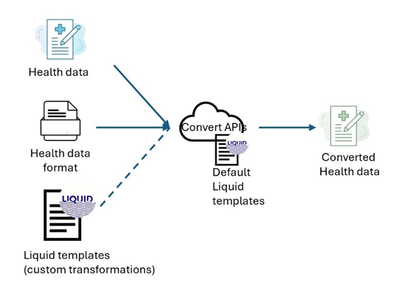

# Skylight fork of microsoft/FHIR Converter
Lorem ipsum dolor sit amet.

FHIR converter is an open source project that enables conversion of health data from legacy formats to and from FHIR.  The FHIR converter uses the [Liquid template language](https://shopify.github.io/liquid/) and the .NET runtime.

The Microsoft FHIR converter supports the following conversions: **HL7v2 to FHIR**, **C-CDA to FHIR**, **JSON to FHIR**, **FHIR STU3 to R4**, and **FHIR to HL7v2** (*Preview*).

The Skylight fork has added support for **eCR to FHIR** and **ELR to FHIR**. Some other changes to the code were needed to support these conversions in addition to the new functionality. These converters are still under active development and are not yet fully validated.

The converter uses templates that define mappings between these different data formats. The templates are written in [Liquid](https://shopify.github.io/liquid/) templating language and make use of custom [filters](docs/Filters-and-Tags.md).  

The converter comes with a few ready-to-use templates. If needed, you can create a new template, or modify existing templates to meet your specific conversion requirements. The provided templates are based off of HL7 v2.8. Other versions may require you to make modifications to these templates on your own. See [Templates & Authoring](#templates--authoring) for specifics.

## Release

Releases and tags will be generated on each commit to main. Tags will be built by using base-version.txt and incrementing a counter at the end. When dibbs-FHIR-Converter syncs with microsoft/FHIR-Converter, base-version.txt should be updated to reflect that new version number.

## What's New?
The latest iteration of the *Preview* FHIR converter makes some significant changes over [previous versions](#previous-versions).

Some of the changes include:
 * Containerized API
 * Support Azure Storage for customer templates.
 * Removal of Azure Container repository dependency for custom templates.
 * Support for FHIR to HL7v2 conversion.

 All the documentation for the new *preview* FHIR converter API can be found in the [How to Guides](docs/how-to-guides/) folder.

## Architecture

The FHIR converter API *preview* provides [REST based APIs](#api) to perform conversion requests.

The FHIR converter APIs are offered as a container artifact in [Microsoft Container Registry](https://github.com/microsoft/containerregistry).
This image can be downloaded and run as a web service on a container hosting platform in your Azure tenant; that clients can target for conversion requests.

## Templates & Authoring

The FHIR converter API comes with several pre-built templates you can use as reference as to create your own.

| Conversion | Notes |
| ----- | ----- |
| [HL7v2 to FHIR](/docs/HL7v2-templates.md)| Important points to note for HL7v2 to FHIR conversion: [see here](docs/HL7v2-ImportantPoints.md)   Common FHIR Validator errors/warning you might run into, and their explanations: [see here](docs/HL7v2-FHIRValidator.md) | 
| [C-CDA to FHIR](/data/Templates/Ccda/) | | 
| [JSON to FHIR](/data/Templates/Json/) | | 
| [FHIR STU3 to R4](/data/Templates/Stu3ToR4/) | [Differences between STU3 & R4](/docs/Stu3R4-resources-differences.md) | 
| FHIR to HL7v2 (*Preview*) | |

### Concepts

In addition to the example [templates](data/Templates) provided there are several important concepts to review and consider when creating your own templates, including:
- [Filters summary](docs/Filters-and-Tags.md)
- [Snippet concept](docs/SnippetConcept.md)
- [Resource Id generation](docs/concepts/resource-id-generation.md)
- [Validation & post processing](docs/concepts/validation-and-postprocessing.md)

To use your custom templates, the FHIR converter API offers robust support for storing and retrieving your templates from Azure storage. For more information see: [Template Store Integration](/docs/how-to-guides/enable-template-store-integration.md).

## Deployment

You can deploy the FHIR converter API using the instructions found [here](/docs/how-to-guides/deployment-options.md). The default deployment will deploy the FHIR Conventer API container hosted on Azure Container Apps.

## API

The conversion APIs process the provided input data of the specified format and use the specified Liquid template (default or custom) and return the converted result as per the transformations in the template.

Complete details on the FHIR converter APIs and examples can be found [here](/docs/how-to-guides/use-convert-web-apis.md).

## Troubleshooting

Some key concepts to consider:
* Processing time is related to both the input message size, template, and logic contained in the template.  If your template is taking a long time to execute make sure you don't have any unnecessary loops.
* The output of the template is expected to be JSON when the target is FHIR.
* When converting data to FHIR, [post processing](https://github.com/microsoft/FHIR-Converter/blob/main/src/Microsoft.Health.Fhir.Liquid.Converter/OutputProcessors/PostProcessor.cs) is performed.  If you are seeing unexpected results, double check the post processing logic. 
* If you want a deeper understanding on how data is converted, look at the functional tests found [here](https://github.com/microsoft/FHIR-Converter/blob/main/src/Microsoft.Health.Fhir.Liquid.Converter.FunctionalTests/ConvertDataTemplateCollectionProviderFunctionalTests.cs)

Detailed troubleshooting options for your deployed FHIR converter API can be found [here](docs/how-to-guides/troubleshoot.md).

## Previous Versions
Detailed documentation of prior Converter release is covered in the table below.

|  Version | Summary | 
| ----- |  ----- |
| [5.x Liquid](https://github.com/microsoft/FHIR-Converter/tree/e49b56f165e5607726063c681e90a28e68e39133) | Liquid engine release covers:   1. HL7v2, CCDA, and JSON to FHIR transformations.   2. Command Line utility.   3. VS Code authoring extension.   4. FHIR Service $convert integration.   5. ACR template storage. |
| [3.x Handlebars](https://github.com/microsoft/FHIR-Converter/tree/handlebars) | Previous handlebars base solution.  No longer supported. See full comparision [here](https://github.com/microsoft/FHIR-Converter/tree/e49b56f165e5607726063c681e90a28e68e39133?tab=readme-ov-file#fhir-converter).

## External resources

- [DotLiquid wiki](https://github.com/dotliquid/dotliquid/wiki)
- [Liquid wiki](https://github.com/Shopify/liquid/wiki)
- [HL7 Community 2-To-FHIR-Project](https://confluence.hl7.org/display/OO/2-To-FHIR+Project)
 
## Contributing

This project welcomes contributions and suggestions. Most contributions require you to agree to a
Contributor License Agreement (CLA) declaring that you have the right to, and actually do, grant us
the rights to use your contribution. For details, visit [the CLA site](https://cla.opensource.microsoft.com).

When you submit a pull request, a CLA bot will automatically determine whether you need to provide
a CLA and decorate the PR appropriately (e.g., status check, comment). Simply follow the instructions
provided by the bot. You will only need to do this once across all repos using our CLA.

This project has adopted the [Microsoft Open Source Code of Conduct](https://opensource.microsoft.com/codeofconduct/).
For more information see the [Code of Conduct FAQ](https://opensource.microsoft.com/codeofconduct/faq/) or
contact [opencode@microsoft.com](mailto:opencode@microsoft.com) with any additional questions or comments.
